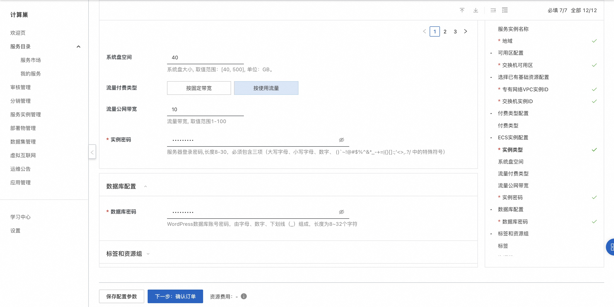
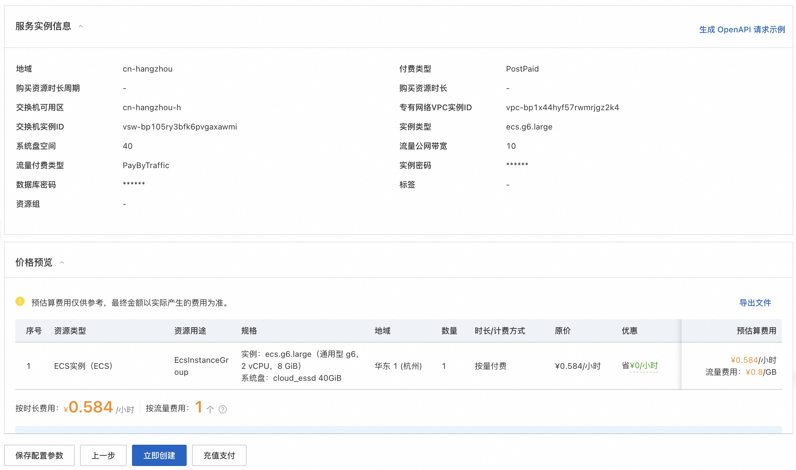
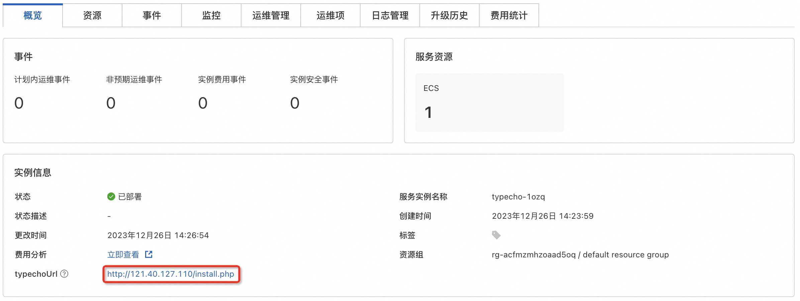
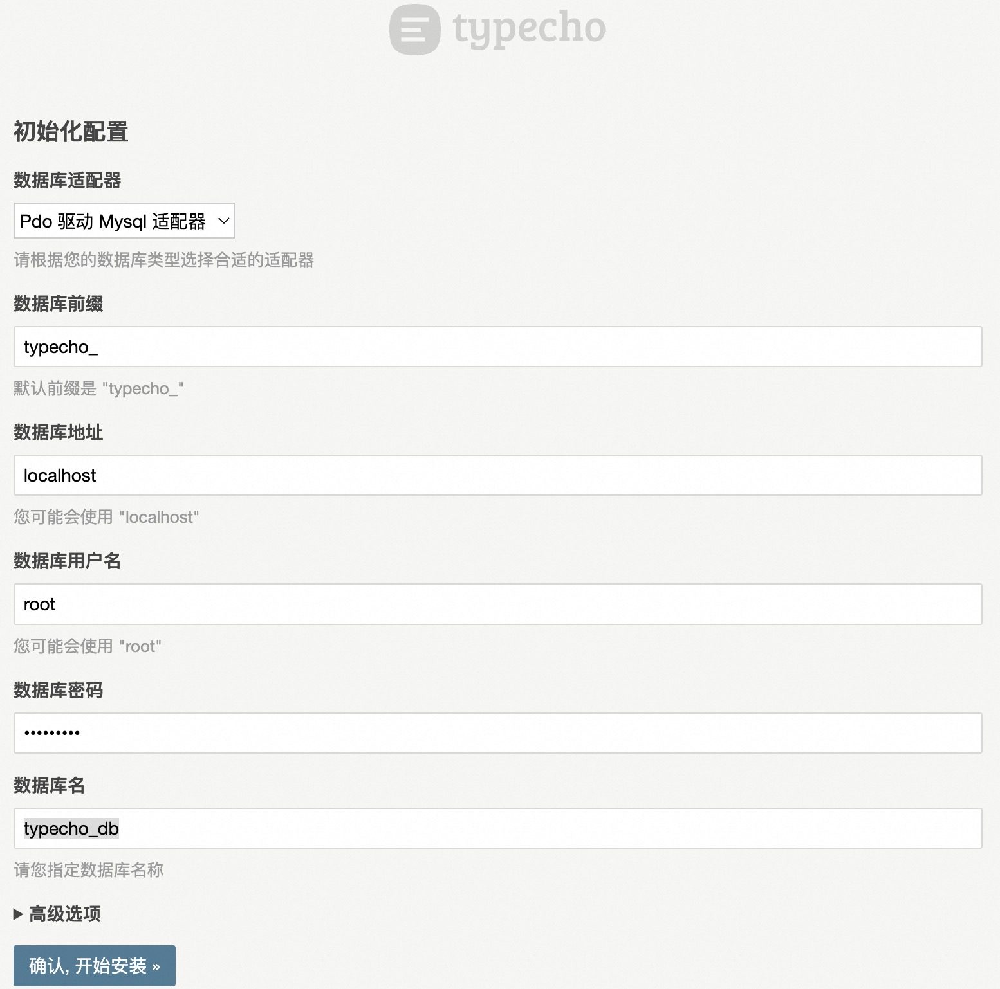
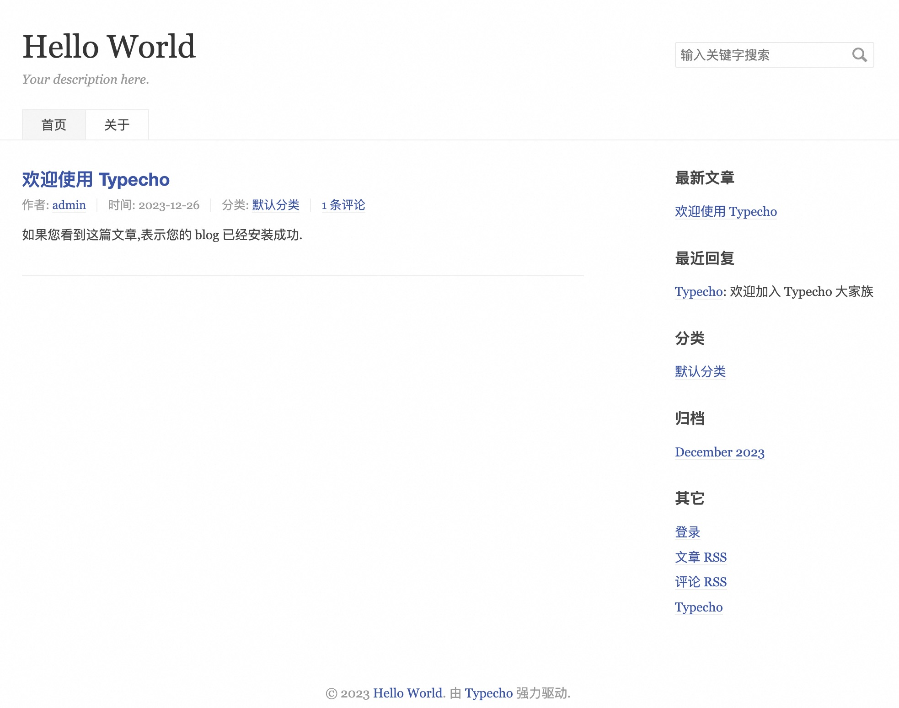

# typecho 计算巢快速部署

## 概述

Typecho基于PHP开发，支持多种数据库，是一款内核强健、扩展方便、体验友好、运行流畅的轻量级开源博客程序。更多信息，请参见[Typecho官网](https://docs.typecho.org/doku.php)。
本文介绍如何使用计算巢快速部署Typecho。

## 前提条件

部署Typecho社区版服务实例，需要对部分阿里云资源进行访问和创建操作。因此您的账号需要包含如下资源的权限。
**说明**：当您的账号是RAM账号时，才需要添加此权限。

| 权限策略名称                          | 备注                         |
|---------------------------------|----------------------------|
| AliyunECSFullAccess             | 管理云服务器服务（ECS）的权限           |
| AliyunVPCFullAccess             | 管理专有网络（VPC）的权限             |
| AliyunROSFullAccess             | 管理资源编排服务（ROS）的权限           |
| AliyunComputeNestUserFullAccess | 管理计算巢服务（ComputeNest）的用户侧权限 |

## 参数说明

| 参数组     | 参数项    | 说明                                                                        |
|---------|--------|---------------------------------------------------------------------------|
| 服务实例    | 服务实例名称 | 长度不超过64个字符，必须以英文字母开头，可包含数字、英文字母、短划线（-）和下划线（_）                             |
|         | 地域     | 服务实例部署的地域                                                                 |
| 网络配置    | 可用区    | ECS实例所在可用区                                                                |
|         | VPC ID | 资源所在VPC                                                                   |
|         | 交换机ID  | 资源所在交换机                                                                   |
| ECS实例配置 | 实例类型   | ECS实例规格                                                                   | 
|         | 付费类型   | 资源的计费类型：按两付费和包年包月                                                         |
|         | 系统盘空间  | 系统盘大小, 取值范围：[40, 500], 单位：GB                                              |
|         | 流量付费类型 | 按固定带宽和按使用流量                                                               |
|         | 实例密码   | 服务器登录密码,长度8-30，必须包含三项（大写字母、小写字母、数字、 ()`~!@#$%^&*_-+={}[]:;'<>,.?/ 中的特殊符号） |
| 数据库配置   | 数据库密码  | typecho数据库(typecho_db)账号(root)密码，由字母、数字、下划线（_）组成，长度为8~32个字符               |

## 部署流程

1. 访问计算巢Typecho社区版[部署链接](https://computenest.console.aliyun.com/service/instance/create/cn-hangzhou?type=user&ServiceId=service-db7c899d37c04551b61e)，按提示填写部署参数：
   

2. 参数填写完成后可以看到对应询价明细，确认参数后点击**下一步：确认订单**，确认订单完成后同意服务协议并点击**立即创建**进入部署阶段。
   

3. 部署成功后进入服务实例详情页，点击typechoUrl安装Typecho。
   

4. 数据库用户名默认为root，数据库密码为部署时填写的数据库密码，数据库名为typecho_db。
   

5. 设置用户名、密码和邮箱，至此typecho安装完成。
  
